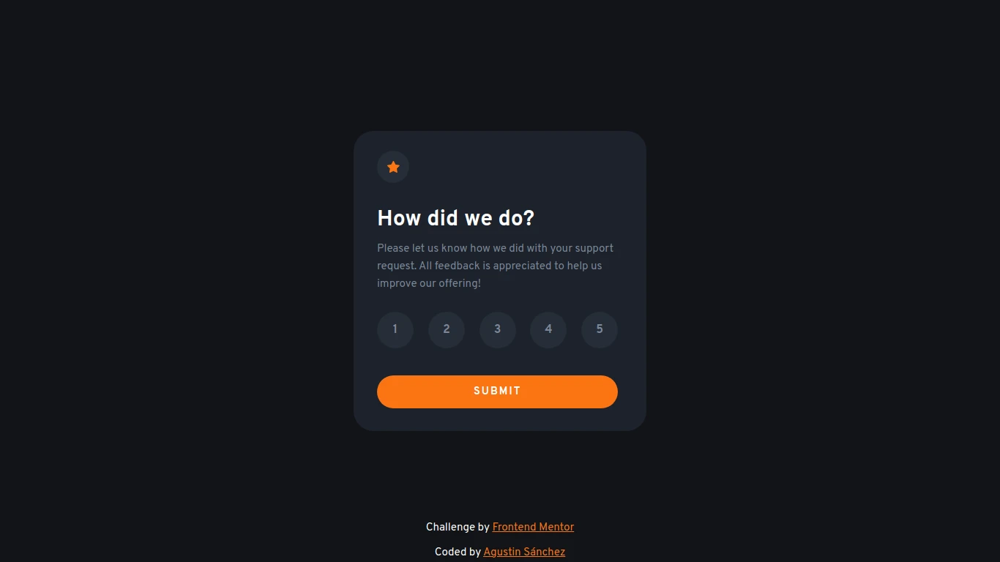
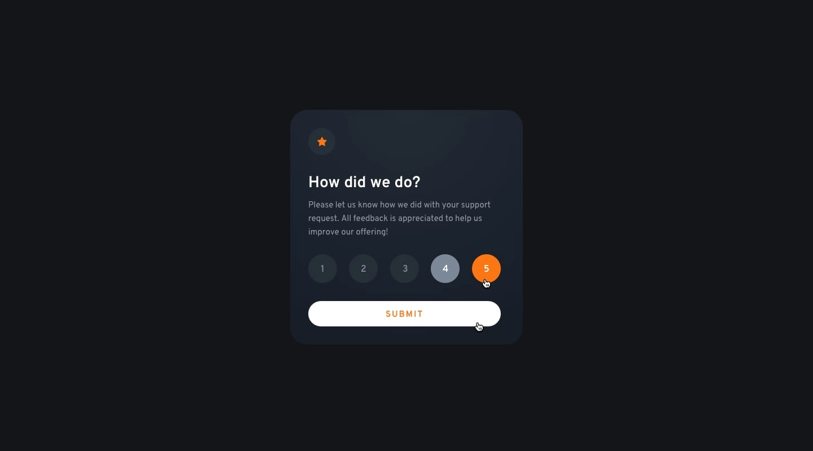
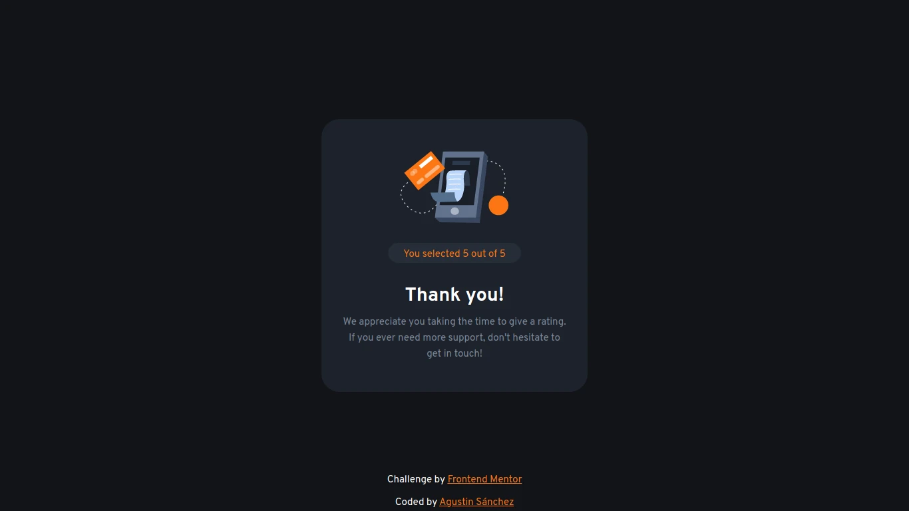

# Frontend Mentor - Interactive rating component solution

This is a solution to the [Interactive rating component challenge on Frontend Mentor](https://www.frontendmentor.io/challenges/interactive-rating-component-koxpeBUmI). Frontend Mentor challenges help you improve your coding skills by building realistic projects.

## Table of contents

- [Overview](#overview)
  - [The challenge](#the-challenge)
  - [Screenshots](#screenshots)
  - [Links](#links)
- [My process](#my-process)
  - [Built with](#built-with)
- [Author](#author)

## Overview

### The challenge

Users should be able to:

- View the optimal layout depending on their device's screen size
- See hover states for all interactive elements on the page
- Select and submit a number rating
- See the "Thank you" card state after submitting a rating

### Screenshots

- Desktop view

- Hover Effects

- Submitted view

### Links

- [Fron End Mentor solution](https://www.frontendmentor.io/solutions/interactive-rating-component-l-p5__DeuW)
- [Live site](https://agusscript.github.io/Interactive-rating-component/)

## My process

### Built with

- Semantic HTML5 markup
- CSS custom properties
- Flexbox
- Responsive Design
- JavaScript

## Author

- Linkedin - [Agustin Emanuel Sanchez](https://www.linkedin.com/in/agustin-emanuel-sanchez-4b2807240/)
- Frontend Mentor - [@agusscript](https://www.frontendmentor.io/profile/agusscript)
- CodePen - [Agustin Sanchez](https://codepen.io/agusscript)
- Twitter - [@agus_script](https://twitter.com/agus_script)
